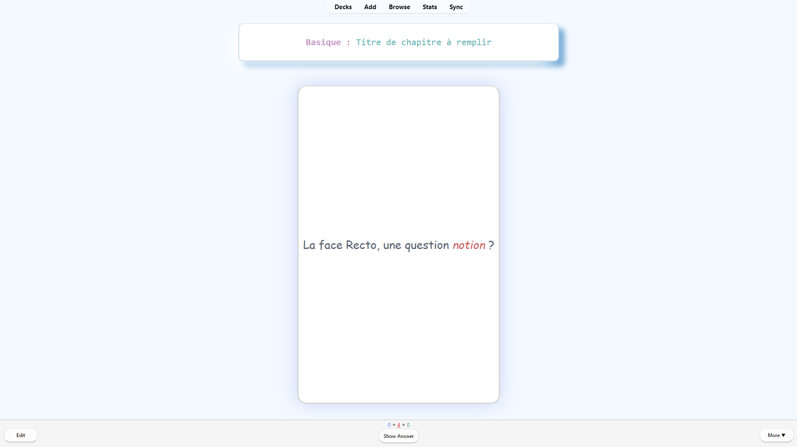
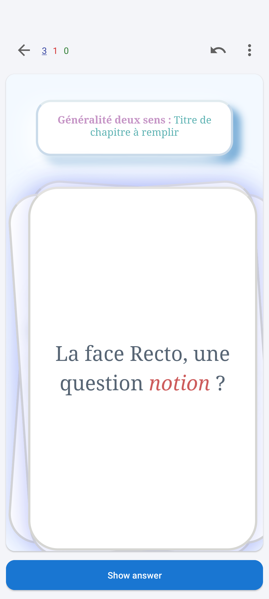
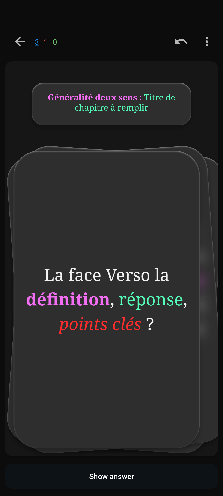

# Anki Style Template

Tested on/Testé sur : `Anki Desktop`, `AnkiDroid`, `AnkiWeb`, `Anki IOS`

### On Desktop :

  
  

### On Mobile :

  
  

## English (Version Française disponible [ici](#version-fr))

### Features
- **Dark and Light Mode**: Automatically adapts to your Anki settings.
- **Flashcard Style**: Designed to look like physical flashcards, modern and simple design.
- **Animations**: Smooth animations for flipping cards on mobile and sliding cards on desktop.
- **Responsive Design**: Works on both desktop and mobile devices.

### How to Use ⇒ Accessible for everyone
1. **Download the Template**: Choose the version you want to use from the `English Version` or `Version Française` folder.
2. **Open Anki**: Launch Anki and open the deck where you want to apply the template.
3. **Edit Card Template**:
   - Go to the "Browse" section.
   - Select the card you want to edit.
   - Click on "Cards..." to open the card template editor.
4. **Apply the Template**:
   - Copy the content from the appropriate file (`basicCard.txt`, `generalitiesCard.txt`, or `clozeCard.txt`).
   - Paste the content into the "Front Template", "Back Template", and "Styling" sections in Anki.
5. **Save and Enjoy**: Save your changes and start using your newly styled flashcards!

**Note**: This template will modify the style for all cards of the same type in your deck.

### License
This project is licensed under the Creative Commons Attribution-NonCommercial 4.0 International License. You are free to share and adapt the material for non-commercial purposes, as long as you give appropriate credit. For more details, see the [LICENSE](LICENSE) file.

---

##  Français

### Fonctionnalités
- **Mode Sombre et Clair**: S'adapte automatiquement aux paramètres d'Anki.
- **Style Carte de Révision**: Conçu pour ressembler à des cartes de révision physiques, avec un design moderne et simple.
- **Animations**: Animations fluides pour retourner les cartes sur mobile et faire glisser les cartes sur desktop.
- **Design Réactif**: Fonctionne sur les appareils de bureau et mobiles.

### Comment Utiliser → Accessible à tous
1. **Téléchargez le Template**: Choisissez la version que vous souhaitez utiliser dans le dossier `English Version` ou `Version Française`.
2. **Ouvrez Anki**: Lancez Anki et ouvrez le deck où vous souhaitez appliquer le template.
3. **Modifiez le Template de Carte**:
   - Allez dans la section "Parcourir".
   - Sélectionnez la carte que vous souhaitez modifier.
   - Cliquez sur "Cartes..." pour ouvrir l'éditeur de template de carte.
4. **Appliquez le Template**:
   - Copiez le contenu du fichier approprié (`basicCard.txt`, `generalitiesCard.txt`, ou `clozeCard.txt`).
   - Collez le contenu dans les sections "Modèle du recto", "Modèle du verso", et "Styles" dans Anki.
5. **Enregistrez et Profitez**: Enregistrez vos modifications et commencez à utiliser vos cartes de révision nouvellement stylisées !

**Note**: Ce template modifiera le style pour toutes les cartes du même type dans votre deck.

### Licence
Ce projet est sous licence Creative Commons Attribution-NonCommercial 4.0 International. Vous êtes libre de partager et d'adapter le matériel à des fins non commerciales, tant que vous donnez le crédit approprié. Pour plus de détails, voir le fichier [LICENSE](LICENSE).